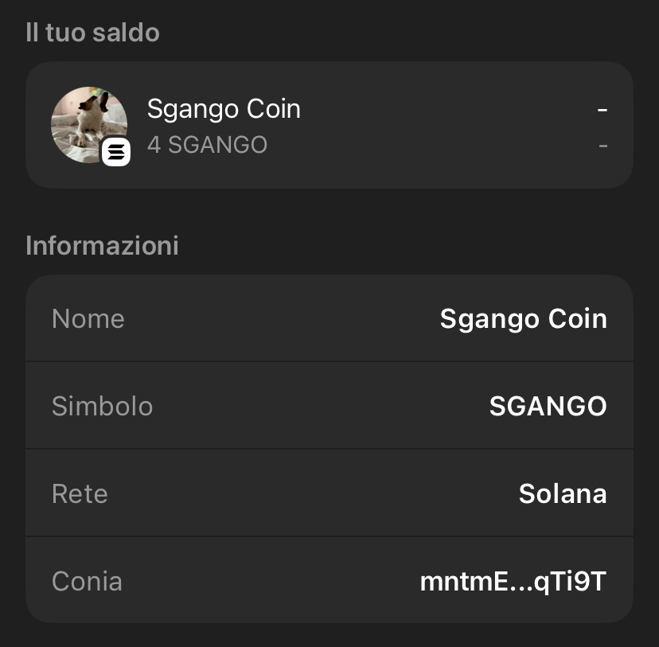

# market_evaluations

<!-- ───────────────────────────────────────────────────────
     ┌─ Banner “Sgango Coin is real” usando shields.io ─┐
     └────────────────────────────────────────────────────── -->

  <!-- badge for-the-badge style, logo Solana e colore a scelta -->
  

<!-- ───────────────────────────────────────────────────────────
     ┌─ Foto centrata (sostituisci il path con il tuo) ─┐
     └────────────────────────────────────────────────────────── -->

  

<!-- ──────────────────────────────────────────────────────────────────
     ┌─ Payoff in piccolo ────────────────────────────────────────┐
     └───────────────────────────────────────────────────────────────── -->

  
    Non investite in crypto,  
    ma solo in <strong>Sgango</strong> 🚀
  

<!-- ──────────────────────────────────────────────────────────
     ┌─ Qui inizia il resto del tuo README ────────────────┐
     └───────────────────────────────────────────────────────── -->

# Avvertenza

Questo progetto è stato creato unicamente a scopo formativo e sperimentale.  
I risultati prodotti dal codice **non devono** essere interpretati come raccomandazioni o consigli di investimento.  

## Scopo del repository

La repository contiene script e notebook pensati per analizzare dati di mercato, testare strategie e mostrare esempi di valutazioni finanziarie.  
Ogni output è frutto di simulazioni e ipotesi che potrebbero non riflettere le condizioni reali o future dei mercati.  

## Nessuna consulenza finanziaria

Gli autori non sono consulenti finanziari registrati.  
Le informazioni offerte non costituiscono in alcun modo consulenza finanziaria, legale o fiscale.  
Prima di prendere decisioni di investimento è indispensabile rivolgersi a un professionista qualificato.  

## Responsabilità personale

Qualsiasi uso del codice avviene sotto la piena responsabilità dell’utente.  
Gli autori declinano ogni responsabilità per eventuali perdite o danni derivanti dall’uso diretto o indiretto di questo materiale.   

